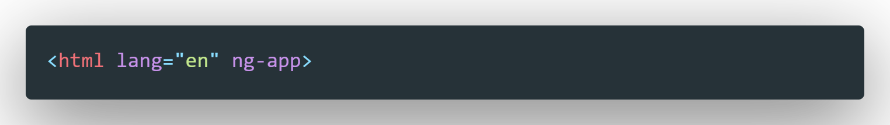

# AngularJS 1.x

谷歌开源前端框架，https://angularjs.org

## 特性与优点

1. 双向数据绑定
2. 声明式依赖注入
3. 解耦应用逻辑、数据模型、视图
4. 完善的页面指令
5. 定制表单验证
6. Ajax 封装

## 可以干什么?

1. SPA 单页面应用
   - 将所有活动局限在一个页面
   - 页面中有部分数据发生变化时不会刷新整个页面，而是局部刷新
2. Web App

## Hello world

* 导入angular.js, 并在页面中引入
* 在<html><body>中ng-app指令
* 定义ng-model='xxx'/{{xxx}}

## 四个重要概念

1. **双向数据绑定**
   * View（视图）： 页面（标签、指令，表达式）
   * Model(模型) ：作用域对象（属性、方法）
   * 数据绑定： 数据从一个位置自动流向另一个位置
     * View-->Model
     * Model-->View
   * 单向数据绑定： 只支持一个方向
     * View-->Model  ： ng-init
     * Model-->View  : {{name}}
   * 双向数据绑定
     * Model<-->View  : ng-model
   * angular是支持双向数据绑定的
2. **依赖注入**
   * 依赖的对象被别人(调用者)自动注入进入
   * 注入的方式;
     * 内部自建：不动态 
     * 全局变量：污染全局环境
     * 形参：这种最好
   * angualr就是通过声明式依赖注入， 来得到作用域对象 
   * 形参名不能随便定义（只是针对当前这种写法）
3. ** MVC模式**

  * **M: Model, 即模型**, 在angular中: 
    * 为scope
    * 储存数据的容器
    * 提供操作数据的方法
  * **V: View, 即视图**, 在angular中:
    * 为页面
    * 包括: html/css/directive/expression
    * 显示Model的数据
    * 将数据同步到Model
    * 与用户交互
  * **C: Controller, 即控制器**, 在angular中:
    * 为angular的Controller
    * 初始化Model数据
    * 为Model添加行为方法

4. **MVVM模式**

  * M: Model, 即数据模型, 在angular中:
    * 为scope中的各个数据对象
  * V: View, 即视图, 在angular中:
    * 为页面
  * VM: ViewModel, 即视图模型, 在angular中:
    * 为scope对象
  * 在angular中controller不再是架构的核心，在MVVM中只是起辅助作用，用来辅助$scope对象，即VM层

---

## 三个重要对象

1. **作用域**
   * 是一个js实例对象
   * 这个对象的属性、方法， 页面都可以直接引用、操作
   * ng-app指令： 内部创建一个根作用域（$rootScope）, 是所有其它作用域的父对象
2. **控制器**
   * 也是一个对象，是我们View与Model之间的桥梁
   * 当我们使用了ng-controller指令， 内部就会创建控制器对象
   * 但我们同时得提供控制器的构造函数（必须定义一个$scope的形参）
   * 每定义一个ng-controller指令， 内部就会创建一个新的作用域对象（$scope）, 并自动注入构造函数中,在函数内部可以直接使用$scope对象。
3. **模块**
   * 也是一个对象，一个模块包含两个部分：
     1. 模块可以定义自己的控制器、服务、工厂类、指令
     2. 模块可以依赖其他模块
     3. 可以通过将模块名称传给ng-app指令，作为应用的入口
   * 创建模块对象： angular.module('模块名', [依赖的模块])
     1. 没有第二个参数时，表示查找模块
   * 通过模块添加控制器：
     * module.controller('MyController', function($scope){//操作$scope的语句})
   * angular的整体设计也是多模块的
     * 核心模块： angular.js
     * 扩展模块： angular-router.js, angular-message.js, angular-animate.js

---

## 三个页面语法

1. **表达式**
   * {{js表达式}}
   * 从作用域对象中读取对应的属性数据来显示数据
   * 不支持if/for/while
   * 支持三目表达式
2. **指令**
   * 什么指令 ： 自定义标签属性/标签
   * 常用的指令：
     * ng-app: 指定模块名，angular管理的区域
     * ng-model： 双向绑定，输入相关标签
     * ng-init： 初始化数据
     * ng-click： 调用作用域对象的方法（点击时）
       可以传$event
     * ng-controller: 指定控制器构造函数名，内部会自动创建一个新的子作用域（外部的）
     * ng-bind： 解决使用{{}}显示数据闪屏（在很短时间内显示{{}}）
     * ng-repeat： 遍历数组显示数据， 数组有几个元素就会产生几个新的作用域
       * $index, $first, $last, $middle, $odd, $even
     * ng-show: 布尔类型， 如果为true才显示
     * ng-hide: 布尔类型， 如果为true就隐藏
     * ng-class: 动态引用定义的样式  {aClass:true, bClass:false}
    * ng-style: 动态引用通过js指定的样式对象   {color:'red', background:'blue'}
    * ng-mouseenter: 鼠标移入监听, 值为函数调用, 可以传$event
    * ng-mouseleave: 鼠标移出监听, 值为函数调用, 可以传$event
3. **过滤器**
   * 作用: 在显示数据时可以对数据进行格式化或过滤
     * 单个--->格式化（将别的类型的数据转换为特定格式的字符串）
     * 多个----》格式化/过滤
     * 不会真正改变被操作数据
   * {{express | 过滤器名：补充说明}}
   * 常用过滤器：
     * currency 货币格式化(文本)
     * number数值格式化(文本)
     * date 将日期对象格式化(文本)
     * json: 将js对象格式化为json(文本)
     * lowercase : 将字符串格式化为全小写(文本)
     * uppercase : 将字符串格式化全大写(文本)

     * limitTo 从一个数组或字符串中过滤出一个新的数组或字符串
       * limitTo : 3  limitTo : -3
     * orderBy : 根据指定作用域属性对数组进行排序
       * {{[2,1,4,3] | orderBy}}  升序
       * {{[2,1,4,3] | orderBy：‘-’}}  降序
       * {{[{id:2,price:3}, {id:1, price:4}] | orderBy:'id'}  id升序
       * {{[{id:2,price:3}, {id:1, price:4}] | orderBy:'-price'} price降序
     * filter : 从数组中过滤返回一个新数组
       * {{[{id:22,price:35}, {id:23, price:45}] | filter:{id:'3'}} //根据id过滤
       * {{[{id:22,price:35}, {id:23, price:45}] | filter:{$:'3'}} //根据所有字段过滤

---

# 指令及控制器

## 指令

ng-bind：

- ng-bind 与花括号表达式：ng-bind 更快，AngularJS 启动时会将花括号转化为 ng-bind，这会花点时间，这也是为什么会在页面中看到一闪而过的花括号。不过只在初次加载时会有。可以使用 ng-cloak 指令解决。

ng-cloak：在应用启动到加载完毕之间的时间段隐藏页面。

ng-repeat:

ng-show：

ng-hide：

ng-class:


## 控制器

ng-controller

该指令将创建的控制关联到DOM上

```javascript
       // 控制器业务代码
        function ctrl() {
            // 定义一个self变量指向控制器实例，而不要直接使用this：保证this指向正确
            let self = this;
            self.msg = 'Hello';
            self.changeMsg = function () {
                if (self.msg === 'Hello') {
                    self.msg = 'Goodbye~'
                } else {
                    self.msg = 'Hello'
                }
                
            }
        }

        // 注册控制器
        angular.module('notesApp', []).controller('MainCtrl', [ctrl]);
```

<u>数据驱动，模型为王</u>，只需关注JS代码，更新UI自动完成

---

# AngularJS 启动过程

1. 当页面加载完毕之后，AngularJS 开始查找 ng-app 命令
2. 找到ng-app指令后加载其指定的模块
3. 在ng-app对应根节点及其子节点中查找指令及数据绑定语句
4. 每当找到ng-controller和ng-repeat指令时都创建一个作用域作为相应元素的上下文，作用域决定了DOM元素可以访问的函数和变量
5. 为变量添加监视器和侦听器并追踪它们的变化，当发生变化时立即更新视图

***


# AngularJS 1.X 学习，以官网教程为例

## Get Start

### ng-app



```html
<html lang="en" ng-app="phonecatApp">
    
</html>
```

`ng-app`指令标记了AngularJS脚本的作用域，在`<html>`中添加`ng-app`属性即说明整个`<html>`都是AngularJS脚本作用域。开发者也可以在局部使用`ng-app`指令，如`<div ng-app>`，则AngularJS脚本仅在该`<div>`中运行

### **AngularJS脚本标签：**

```javascript
<script src="lib/angular/angular.js"></script>
```

载入angular.js脚本，当浏览器将整个HTML页面载入完毕后将会执行该angular.js脚本，angular.js脚本运行后将会寻找含有`ng-app`指令的HTML标签，该标签即定义了AngularJS应用的作用域

### 引导AngularJS应用

通过ngApp指令来自动引导AngularJS应用是一种简洁的方式，适合大多数情况。在高级开发中，例如使用脚本装载应用，您也可以使用bootstrap手动引导AngularJS应用。

**AngularJS应用引导过程有3个重要点：**

1. [注入器](https://www.angularjs.net.cn/tutorial/17.html)将用于创建此应用程序的依赖注入(dependency injection)；
2. 注入器将会创建[根作用域](https://docs.angularjs.org/api/ng/service/$rootScope)作为我们应用模型的范围；
3. AngularJS将会链接根作用域中的DOM，从用ngApp标记的HTML标签开始，逐步处理DOM中指令和绑定。

一旦AngularJS应用引导完毕，它将继续侦听浏览器的HTML触发事件，如鼠标点击事件、按键事件、HTTP传入响应等改变DOM模型的事件。这类事件一旦发生，AngularJS将会自动检测变化，并作出相应的处理及更新。


### 视图和模板

```html
<html ng-app="phonecatApp">
<head>
  ...
  <script src="bower_components/angular/angular.js"></script>
  <script src="js/controllers.js"></script>
</head>
<body ng-controller="PhoneListCtrl">

  <ul>
    <li ng-repeat="phone in phones">
      <span>{{phone.name}}</span>
      <p>{{phone.snippet}}</p>
    </li>
  </ul>

</body>
</html>
```


**控制器**通过为我们的上下文提供数据模块，允许我们在模块和视图之间建立数据绑定

- `PhoneListCtrl`控件在`$scope`上附加了手机数据，把它注入到我们的控制器函数中。该**作用域**是**根作用域**的原型化的后代，在定义应用程序的时候创建了该根作用域。该控制器作用域可以在元素标签`<body ng-controller="PhoneListCtrl">`内部的所有绑定位置上可用。

```js
var phonecatApp = angular.module('phonecatApp', []);

// 声明了一个控制器，称为PhoneListCtrl，并把它注册到一个AngularJS模块PhonecatApp
// PhoneListCtrl 构造器函数，需要$scope参数
phonecatApp.controller('PhoneListCtrl', function ($scope) {
  $scope.phones = [
    {'name': 'Nexus S',
     'snippet': 'Fast just got faster with Nexus S.'},
    {'name': 'Motorola XOOM? with Wi-Fi',
     'snippet': 'The Next, Next Generation tablet.'},
    {'name': 'MOTOROLA XOOM?',
     'snippet': 'The Next, Next Generation tablet.'}
  ];
});
```


### 作用域

#### 什么是作用域？

- 是一个存储应用数据模型的对象
- 为 [表达式](https://www.angularjs.net.cn/tutorial/3.html) 提供了一个执行上下文
- 作用域的层级结构对应于 DOM 树结构
- 作用域可以监听 [表达式](https://www.angularjs.net.cn/tutorial/3.html) 的变化并传播事件

***

#### 作用域有什么？

- 作用域提供了 ([`$watch`](https://www.angularjs.net.cn/tutorial/api/ng.$rootScope.Scope#methods_$watch)) 方法监听数据模型的变化
- 作用域提供了 ([`$apply`](https://www.angularjs.net.cn/tutorial/api/ng.$rootScope.Scope#methods_$apply)) 方法把不是由Angular触发的数据模型的改变引入Angular的控制范围内（如控制器，服务，及Angular事件处理器等）
- 作用域提供了<u>基于原型链继承</u>其父作用域属性的机制，就算是嵌套于独立的应用组件中的作用域也可以访问共享的数据模型（这个涉及到指令间嵌套时作用域的几种模式）
- 作用域提供了 [表达式](https://www.angularjs.net.cn/tutorial/3.html) 的执行环境，比如像 `{{username}}` 这个表达式，必须得是在一个拥有属性这个属性的作用域中执行才会有意义，也就是说，作用域中可能会像这样 `scope.username` 或是 `$scope.username`，至于有没有 $ 符号，看你是在哪里访问作用域了

***

#### 作用域作为数据模型使用

<u>作用域是Web应用的控制器和视图之间的粘结剂</u>

- 控制器 --> 作用域 --> 视图（DOM）
- 指令 --> 作用域 --> 视图（DOM）

**作用域(scope)**对象以及其属性是视图渲染的唯一数据来源

***

#### 作用域分层结构

作用域的结构对应于DOM结构，最顶层和DOM树有根节点一样，每个Angular应用有且仅有一个 [`root scope`](https://www.angularjs.net.cn/tutorial/api/ng.$rootScope)，子级作用域就和DOM树的子节点一样，可以有多个的。

应用可以拥有多个作用域，比如 [指令](https://www.angularjs.net.cn/tutorial/guide/directive) 会创建子级作用域，一般情况下，当新的作用域被创建时，它是以嵌入在父级作用域的子级的形式被创建的，这样就形成了与其所关联的DOM树相对应的一个作用域的树结构

***作用域的分层的一个简单例子***：

假设现在HTML视图中有一个表达式 `{{name}}` ，Angular需要经历取值和计算两个阶段才能最终在视图渲染结果。那么这个取值的阶段，其实就是根据作用域的这个层级结构（或树状结构）来进行的。

- 首先，Angular在该表达式当前所在的DOM节点所对应的作用域中去找有没有 `name` 这个属性
- 如果有，Angular返回取值，计算渲染；如果在当前作用域中没有找到，那么Angular继续往上一层的父级作用域中去找 `name` 属性，直到找到为止，最后实在没有，那就到达 `$rootScope` 了

上面一个简单的例子展示了在作用域分层结构中找属性，是基于原型继承的模式。

#### 基于作用域的事件传播

作用域可以像DOM节点一样，进行事件的传播。主要是有两个方法：

- [`broadcasted`](https://www.angularjs.net.cn/tutorial/api/ng.$rootScope.Scope#methods_$broadcast) ：从父级作用域广播至子级 scope
- [`emitted`](https://www.angularjs.net.cn/tutorial/api/ng.$rootScope.Scope#methods_$emit) ：从子级作用域往上发射到父级作用域

***

### 作用域的生命周期

#### scope生命周期拆解

1. **创建期**

    [`root scope`](https://www.angularjs.net.cn/tutorial/api/ng.$rootScope) 是在应用程序启动时由 [`$injector`](https://www.angularjs.net.cn/tutorial/api/AUTO.$injector) 创建的。另外，在指令的模版链接阶段（template linking），指令会创建一些新的子级 scope。

2. **注册$watch**

    在模版链接阶段（template linking），指令会往作用域中注册 [`监听器(watch)`](https://www.angularjs.net.cn/tutorial/api/ng.$rootScope.Scope#methods_$watch)，而且不止一个。这些 `$watch` 用来监测数据模型的更新并将更新值传给DOM。

3. **数据模型变化**

    正如上面一节所提到的，要想让数据模型的变化能够很好的被Angular监测，需要让它们在 [`scope.$apply()`](https://www.angularjs.net.cn/tutorial/api/ng.$rootScope.Scope#methods_$apply) 里发生。 当然，对于Angular本身的API来讲，无论是在控制器中做同步操作，还是通过 [`$http`](https://www.angularjs.net.cn/tutorial/api/ng.$http) 或者 [`$timeout`](https://www.angularjs.net.cn/tutorial/api/ng.$timeout) 做的非同步操作， 抑或是在Angular的服务中，是没有必要手动去将数据模型变化的操作放到 `$apply()` 中去的，因为Angular已经隐式的为我们做了这一点。

4. **数据模型变化监测**

    在把数据变化 `$apply` 进来之后，Angular开始进入 [`$digest`](https://www.angularjs.net.cn/tutorial/api/ng.$rootScope.Scope#methods_$digest) 轮循（就是调用 `$digest()` 方法），首先是 rootscope 进入 `$digest` ，然后由其把各个监听表达式或是函数的任务传播分配给所有的子级作用域，那样各个作用域就各司其职了，如果监听到自己负责的数据模型有变化，马上就调用 `$watch` 。（*译注：这里所说的从根scope往下分发是译者自己的想法，如有错误，请纠正*）

5. **销毁作用域**

    当子级作用域不再需要的时候，这时候创建它们的就会负责把它们回收或是销毁（注：比如在指令中，创建是隐式的，销毁可以不但可以是隐式的，也可以是显式的，如 `scope.$destroy()`）。销毁是通过 [`scope.$destroy()`](https://www.angularjs.net.cn/tutorial/api/ng.$rootScope.Scope#methods_$destroy) 这个方法。销毁之后，`$digest()` 方法就不会继续往子级作用域传播了，这样也就可以让垃圾回收系统把这一个作用域上用来存放数据模型的内存给回收利用了。

#### 作用域的执行上下文

浏览器接收一个事件的标准的工作流程应该是:

```
接收事件 --> 触发回调 --> 回调执行结束返回 --> 浏览器重绘DOM --> 浏览器返回等待下一个事件
```

上面的过程中，如果一切都发生在Angular的执行上下文的话，那相安无事，Angular能够知道数据模型发生的改变；但是如果当浏览器的控制权跑到原生的 JavaScript中去时（译注：比如通过jQuery监听事件之类的非Angular的回调等），那么应用执行的上下文就发生在Angular的上下文之外了，这样就导致Angular无法知晓数据模型的任何改变

通过使用 [`$apply`](https://www.angularjs.net.cn/tutorial/api/ng.$rootScope.Scope#methods_$apply) 方法让上下文执行环境重新进入到Angular的上下文中（*注：用法 `$scope.$apply()`*）。只有执行上下文重新回到Angular中，那样数据模型的改变才能被Angular所识别并作出相应操作（注：当然，如果执行上下文没有发生改变，也就没有必要显式地去进行 $apply 操作）。


