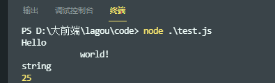

# ES2015/ES6

ES2015 also called ES6，解决了之前版本的一些问题如var作用域，对原有语法进行增强，新增了全新的对象、方法、功能、数据类型和数据结构。

nodemon 工具：修改完代码后自动执行。

## let/const

使用var声明的变量，存在提升，在全局作用域中声明则会成为window对象的属性，在函数中声明会自动提升到函数作用域顶部。

通过var定义的全局变量和函数会成为window对象的属性和方法，而使用let/const的顶级声明则不会。

let 声明不能重复声明同一个变量。

ES6之前使用闭包解决作用域的问题，如下：

```js
for (var i = 0; i < 5; i++) {
    setTimeout(() => console.log(i), 0);
}
// 当每次 for 循环时，把此时的变量 i 通过立即执行函数传递到定时器中，然后立即执行
for(var i = 0; i< 5; i++) {
   (function(x){
        setTimeout(() => console.log(x), 0);
    })(i);
}
```

ES6之后使用let声明完美解决问题。

const 和 let 基本一样，唯一区别是const声明的变量不能修改，用来声明常量。

**最佳实践**：<u>不用var，主用const，let配合使用。</u>

---

## 解构

更便捷的访问数据

### 数组解构

```js
let colors = ["red", "green", "blue"];

// 未显示声明的元素会被忽略，比如这里的"blue"
let [firstColor, secondColor] = colors;

console.log(firstColor); // "red"
console.log(secondColor); // "green"

// 可以省略元素只为需要的元素提供变量名
let [,,third] = colors;
console.log(third);// "blue"
```

解构赋值：数组的解构赋值不需要使用小括号包裹

```js
let colors = ["red", "green", "blue"],
    firstColor = "black",
    secondColor = "purple";
[firstColor, secondColor] = colors;
console.log(firstColor); // "red"
console.log(secondColor); // "green"
```

**数组解构的妙用：交换两个变量的值**

```js
let a = 1, b = 2;
[a, b] = [b, a]; // 赋值语句左边是一个解构模式，右边是一个临时数组字面量。
console.log(a);
console.log(b);
```

指定位置的属性在数组中不存在则默认为undefined，此时可以为其定义一个其他的默认值。

嵌套数组解构：

```js
let colors = ["red", ["green", "lightgreen"], "blue"];

let [first, [second]] = colors;
console.log(first); // "red"
console.log(second); // "green"
```

不定元素：通过 `...`语法将数组其余元素赋值给一个特定变量。<u>不定元素必须为最后一项</u>

```js
let colors = ["red", "green", "blue"];
let [firstColor, ...restColors] = colors;
 
console.log(firstColor); // "red"
console.log(restColors.length); 2
console.log(restColors[0]); // "green"
console.log(restColors[1]); // "blue"
```

---

### 对象解构

```js
let node = {
    type: "identifier",
    name: "foo"
}
let {type, name} = node;
console.log(type);
console.log(name);
```

解构赋值：在定义变量之后修改其值可以使用解构语法

```js
let node = {
        type: "identifier",
        name: "foo"
    },
    type = "Literal",
    name = 5;
({type,name} = node);
console.log(type);
console.log(name);
```

***用小括号包裹解构赋值语句***

使用解构赋值时，局部变量名称在对象中不存在则默认为undefined，此时可以为其定义一个其他的默认值。

```js
let node = {
    type: "identifier",
    name: "foo"
}
let {type, name, value} = node;
console.log(value) // undefined
// 为对象中不存在的变量指定默认值
let {type, name, value = true} = node;
```

为非同名变量赋值，希望使用和对象中不同名的局部变量来存储对象属性的值时，使用如下方法：

```js
let node = {
    type: "identifier",
    name: "foo"
}
// 读取名为type的属性并存储其值到变量localType中
let {type: localType, name: localName} = node;
console.log(localType);
console.log(localName);
```

嵌套对象解构：

```js
let node = {
    type: "identifier",
    name: "foo", 
    loc: {
        start: {
            line: 1,
            column: 1
        },
        end: {
            line: 1, 
            column: 4
        }
    }
}
// 嵌套对象解构语法
let {loc: {start}} = node;
console.log(start.line);
console.log(start.column);
```

---

### 解构参数

解构可以用在参数传递中。

```js
// 不适用解构参数的情况
function setCookie(name, value, options) {
    options = options || {}
    let secure = options.secure,
        path = options.path,
        domain = options.domain,
        expires = options.expires;
    // some codes
}

setCookie("type", "js", {
    secure: true,
    expires: 60000
})
// 解构参数需要使用对象或数组解构模式代替命名参数
function setCookie(name, value, {secure, path, domain, expires}) {
    // some codes
}

setCookie("type", "js", {
    secure: true,
    expires: 60000
})
// 如果解构参数是可选的，则必须为其提供默认值
function setCookie(name, value, {secure, path, domain, expires} = {}) {
    // some codes
}
```

---

## 模板字符串

模板字面量解决了ES6之前的对于字符串操作的一些不足，如多行字符创、字符串格式化、HTML转义（向HTML插入安全转换后的字符串）。

基本用法：使用反撇号 `` 替换单双引号。

```js
let msg = `Hello world!`;
console.log(msg);
console.log(typeof msg);
console.log(msg.length);
```

**多行字符串**：

ES6前创建多行字符串，一种方法是手动加入换行符，但不建议使用，反斜杠延续代码被视作JS的bug，应避免使用。而更多的通过数组或字符串拼接创建多行字符串

```js
// 反斜杠 \ 用来延续上一行，再加上换行符 \n 避免使用
let message = "Multiple \n\
line"

console.log(message);

let message = ["Multiple", "String"].join("\n");
let msg = "Multiple \n" + "String"
```

使用模板字面量则直接换行即可，但是要注意反撇号中所有空白字符都属于字符串中的一部分，需要特别注意缩进，推荐第一行留白，并在后面行中缩进。[]()

```js
let msg = `Hello 
            world!`;

console.log(msg);
console.log(typeof msg);
console.log(msg.length);

let html = `
<div>
    <h1>Title</h1>
</div>`.trim(); // trim() 去掉第一行的留白
```



**字符串占位符**

占位符`${expression}`可以将任何合法的JS表达式嵌入到占位符作为字符串的输出结果。

```js
let name = "Andy", msg = `hello, ${name}.`; // 占位符访问变量name并将其插入到msg字符串

console.log(msg); // "hello, Andy."
```

除了变量外，还可以嵌入如运算式、函数调用等。模板字面量本身也是表达式，也可以嵌入。

```js
let count = 10, 
price = 0.25, 
msg = `${count} items cost $${(count * price).toFixed(2)}`;

console.log(msg); // "10 items cost $2.50"

let name = "Andy", msg = `hello, ${`my name is ${name}`}.`; // "hello, my name is Andy."
```

**模板标签**

模板字面量真正的威力来自模板标签。模板标签可以执行模板字面量上的转换并返回最终的字符串值，主要用来对模板字符串进行加工如文本多语言化，检查文本是否含有不安全的字符或者实现一个小型的模板引擎。

标签是在模板字面量第一个反撇号前标注的字符串，如：

```js
let msg = tag`hello world`; // 模板标签为tag
```

标签可以是一个函数，调用时传入加工过的模板字面量各部分数据。第一个参数是包含JS解释过后的字面量字符串的数组，之后的参数都是每一个占位符的解释值,，可以单独传参，但是我们通常使用不定参数来定义占位符以简化数据处理过程。

```js
// 占位符解释值单独传参
function tag(array, count, price)
// 使用不定参数
function tag(literals, ...substitutions) {
    // return a string
}
```

来看一个例子：

```js
function tag(literals, ...substitutions) {
    let result = "";
    
    for (let i = 0; i < substitutions.length; i++) {
        result += literals[i];
        result += substitutions[i];
    }

    // 合并最后一个模板字符串值
    result += literals[literals.length - 1];
    return result;
}

let count = 10,
price = 0.25,
// 传参为: tag(["", " items cost $", "."], 10, 0.25)
msg = tag`${count} items cost $${(count * price).toFixed(2)}.`;
```

**模板字面量中使用原始值**

模板标签同样可以访问原生字符串信息，即可以访问到字符转义被转换成等价字符前的原生字符串，使用内建的`String.raw()`标签。

```js
let msg1 = `Multiple\nstring`;
let msg2 = String.raw`Multiple\nstring`;

console.log(msg1); // "Multiple"
                   // "string"
console.log(msg2); // "Multiple\nstring"
```

---

## 字符串的扩展方法

**includes()**

**startsWith()**

**endsWith()**

---

## 参数默认值

ES6 提供了简化的为形参提供默认值的方法，带有默认值的参数需要在最后。

```js
function func(url, timeout = 2000, callback = function(){}) {

}
```

---

## 剩余参数

即不定参数，使用`...`操作符， 只能出现在形参最后一位

```js
function foo(first, ...args) {
    // code
}
foo(1, 2, 3, 4)
```

`...`还可以用于展开数组。

```
const arr = ["foo", "baz", "buz"];
console.log(...arr); // "foo" "baz" "buz"
```

---

## 箭头函数

和普通函数相比，箭头函数：

1. 没有this、super、arguments、new.target等的绑定， 箭头函数的这些值由声明箭头函数时的上下文决定。
2. 不能通过new关键字调用
3. 没有原型
4. 不可以改变this的绑定
5. 不支持arguments对象
6. 不支持重复的命名参数

---

## 对象字面量的增强

变量名和属性名一致，可以省略变量名，只保留属性名。

**计算属性名**

---

## Object新增方法

**Object.assign()**

**Object.is()**

---

## Proxy

ES6之前使用`Object.defineProperty`来实现对某个对象属性的读写进行监视，vue3.0以前使用该方法实现的数据绑定。

ES6提供了Proxy代理对象来实现。

```js
const person = {
    name: "tom",
    age: 20
}
const personProxy = new Proxy(person, {
    get(target, property) {},
    set(target, property, value) {}
})
```

**Proxy VS Object.defineProperty**

1. Object.defineProperty 只能监视属性的读写，Proxy能够监视到更多对象操作，如delete操作等；
2. Proxy更好的支持数组对象的监视
3. Proxy以非侵入的方式监管对象的读写，

---

## Reflect

