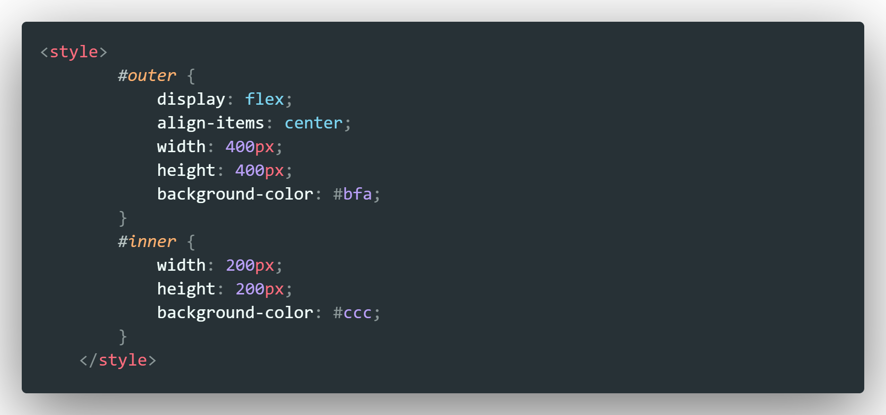
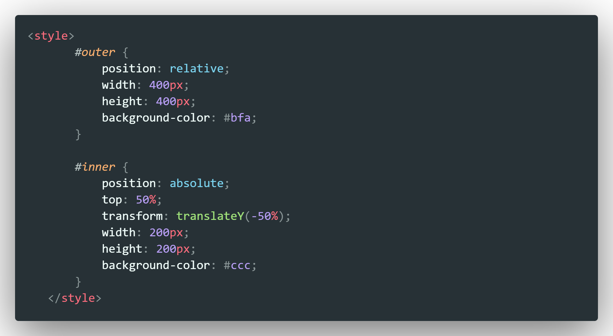

# HTML5

## 语义化

使用特定英文字母或单词表示标签

好处：

1. 代码结构清晰，含义清楚，具有可读性，利于阅读理解
2. 利于SEO，即搜索引擎优化：搜索引擎的爬虫依赖标签确定上下文和各个关键字的权重， 有助于爬虫抓取更多有效信息
3. IE9及以下版本不适用

### H5新增标签与属性（部分）：

1. **结构标签**：

   - `<header>`:  页面或区域的头部
   - `<nav>`: 定义导航链接，一般和ul、li配合做导航栏
   - `<main>`：
   - `<section>`：定义一个区域
   - `<aside>`：定义页面内容部分的侧边栏
   - `<article>`：定义一篇文章
   - `<hgroup>`：定义文件中一个区块的相关信息
   - `<figure>`：定义一组媒体内容以及它们的标题
   - `<figcaption>`：定义 figure 元素的标题
   - `<dialog>`：定义一个对话框(会话框)
   - `<footer>`：定义一个页面或一个区域的底部

2. **多媒体标签**：

   - `<video>` 视频

     ```html
     <video src="..."
            autoplay="autoplay"
            controls="controls"
            loop="loop"
            width="500"
            height="500"
            poster="..."
            muted>
     
     //其中loop设置循环 poster设置封面 muted静音
     ```

     

   - `<audio> ` 音频

     ```html
     <audio src="..."
            autoplay="autoplay"
            controls="controls"
            loop="loop"
            width="500"
            height="500">
     ```

     

   - `<source>` 媒介元素，即音视频

     ```html
     <video autoplay="autoplay"
            controls="controls"
            loop="loop"
            width="500"
            height="500">
         <source src="..." type="video/mp4"
     </video>
     ```

     

   - `<embed>` 嵌入插件

     ```HTML
     <embed src="..."
            type="audio/mp3"
            width="300" 
            height="300" />
     ```

     

3. **重定义标签:**

   - `<b>` 粗体
   - `<i>` 斜体
   - `<dd>` 
   - `<dt>`
   - `<small>` 表示小字体，例如打印注释或者法律条款
   - `<strong>` 表示重要性

4. **其他标签**：

   - `<ruby>`
   - `<rp>`
   - `<rt>`
   - `<mark>`

5. **input 新增 type**：

   - email

   - url

   - range

   - Date picker:

     Date

     Month

     Week

     Time

     Datetime

     Datetime-local

   - search

   - color

   - tel

6. **表单属性**

   - **autocomplete**：自动完成，适用于 <form> 标签，以及以下类型的 <input> 标签：
     text, search, url, telephone, email, password, datepickers, range, color。
     用法：`<form autocomplete="on“></form>`或者单独在input中用off
   - **autofocus**：自动地获得焦点，适用于所有`<input>`标签的类型
     用法：`<input autofocus="autofocus" />`
   - **multiple**：可选择多个值，适用于<input>中type为email和file
     用法：`<input type="file" multiple="multiple" />`
   - **placeholder**：适用于<input>中type为：text, search, url, telephone, email, password
   - **required**：规定不能为空，适用于以下类型的 <input> 标签：
     text, search, url, telephone, email, password, date pickers, number, checkbox, radio, file
     用法：`<input type="text" required="required" />`

7. **链接属性**

   - size
     `<link rel="icon" href="icon.gif" type="image/gif" size="16x16">`
   - target
     
     <base href=“http://localhost/” target=“_blank”>
   - 超链接
     a：media=""（表示对设备进行优化，handhelp对“手持“设备进行支持，tv对”电视）；
     a：hreflang="zh"（设置语言，这里设置语言是中文）；
     a：ref=“external”（设置超链接的引用，这里超链接为外部链接）

8. **其他属性:**

   - defer:加载完脚本后不执行，而是等整个页面加载完之后再执行
     
     `<script defer src=“URL”></script>`
     
   - async:加载完脚本后立刻执行，不用等整个页面都加载完，属于异步执行。
   
     `<script async src=“URL”></script>`
   
   - Start —— 起始值
   
   - Reversed —— 倒叙排列
     <ol start=“10” reversed>
     <li>Html</li>
     <li>Css</li>
     <li>JavaScript</li>
     </ol>
     
   - manifest=“cache.manifest”（定义页面离线应用文件）
     `<html manifest="cache.manifest">`

## 元素分类

### 块级元素

div p ul ol li h1-h6 dl dt form table  hr

### 行内元素

a img span b strong input select section 

区别：

1、块级元素会独占一行 默认的宽度占满父级元素，行内元素不会换行

2、行内元素的width height 无效

3、块级元素可以设置margin和padding属性，行内元素可以设置左右padding和margin，上下不生效

---

# CSS

## 建议属性书写顺序

1. 布局定位属性
   - display / position / float / clear / visibility / overflow
2. 自身属性
   - width / height / margin / padding / border / background
3. 文本属性
   - color / font / text-decoration / text-align / vertical-align / white-space / break-word
4. 其他属性
   - content / cursor / border-radius / box-shadow / text-shadow / background: linear-gradient...

## CSS3新增语法

### 新增选择器

1. **属性选择器**
   - E[attr] 选择具有attr属性的E元素
   - E[attr=val] 选择具有attr属性，且attr的属性值为val（区分大小写）的E元素
   - E[attr^=val] 选择具有attr属性且属性值是以val开头的字符串的E元素
   - E[attr$=val] 属性值以val结尾
   - 其他如：E[attr|=val] , E[attr ~= val], E[attr*=val]
2. **结构伪类选择器**
   - E:first-child
   - E:last-child
   - E F:nth-child(n): 选择父元素E的第n个子元素F，n 可为整数，关键字even、odd，公式
   - E F:nth-last-child(n)：选择元素E的倒数第n个子元素F
   - E:nth-of-type(n): 选择父元素内具有指定类型的第n个E元素
   - E:nth-last-of-type(n)：同上，倒数
   - E:fisrt-of-type 选择类型为E的第一个元素
   - E:last-of-type
   - E:only-child
   - E:only-of-type
   - E:empty：选择没有子元素的元素
3. **伪元素选择器**
   - ::before
   - ::after
   - ::first-line
   - ::first-letter

### filter 属性

filter 属性将模糊或颜色偏移等图形效果应用于元素

- filter：函数()
  1. filter: blur(5px)  数值越大图像越模糊
  2. 其他见文档

### calc 属性

计算CSS属性值，如width，height，等

***

## css不用border设置边框

通过 box-shadow：

box-shadow: x轴偏移 y轴偏移 模糊半径(模糊度) 扩散半径 颜色 inset(默认为外阴影，可设置为内阴影)

```css
 box-shadow: 0 0 0 1px #fcf;
```

可以通过box-shadow 设置内边框以及双层边框

- 内边框：inset

- 双层边框，如照片效果

    

    

---

## BFC

BFC, Block Formatting Context，块级格式化上下文，是一个独立的渲染区域，BFC内部的元素与外部的元素相互隔离，内外元素的定位不会相互影响

**触发条件**：

1. 根元素
2. position: absolute / fixed
3. display: inline-block / table-cell / table-caption / flex / inline-flex
4. float 不为none
5. overflow !== visible

**规则**

1. BFC 中的两个相邻 box 垂直排列
2. BFC 中的两个相邻 Box 的 垂直方向上的 margin 会发生重叠
3. BFC 内部，每个box的margin-left 会紧贴着包含box的容器的border-left
4. BFC 的区域不会与float 的元素区域重叠
5. 计算BFC的高度时，浮动子元素也参与计算
6. 文字层不会被浮动层覆盖

**应用**

- 防止外边距重叠
- 清楚元素内部浮动：overflow: hidden; 
- 自适应两栏布局
- 阻止元素被浮动元素覆盖

***

## 浮动

<u>多个块级元素纵向排列找标准流，横向排列找浮动</u>

1. 浮动属性使元素脱离标准文档流，即 **脱标**
2. 浮动的盒子不再保留原先的位置
3. 任何元素都可以设置浮动，添加浮动之后都具有行内块元素的属性，即行内元素浮动后可以直接设置高度和宽度，无需设置display属性
   - **块级元素如果没有设置宽度，默认和父元素一样宽，但是添加浮动后，大小根据内容来定**
   - 浮动的盒子之间没有缝隙，紧紧挨着
   - 行内元素同理
4. 浮动元素经常和标准流父级搭配使用，即父元素标准流，子元素再浮动
5. 浮动元素只会影响其后的标准流，不会影响前面的标准流

### 清除浮动

父元素高度塌陷：父元素在很多情况下不方便给高度，但子元素又需要浮动，导致父元素高度为0，影响父元素之后的标准流。

清除浮动：

```css
/* 方法1：额外标签法，又隔墙法，在最后一个浮动元素的后面额外添加一个空的块级标签， 通俗易懂书写方便，但是多添加标签，结构化差， 不常用*/
.clear {
    clear: both; /*left, right, both*/
}
/* 方法2：父元素添加overflow属性，设置值为hidden，auto，scroll */
.father {
    overflow: hidden;
}
/* 方法3：父元素添加after伪元素: 额外标签法的升级 */
.clearfix::after {
    content: "";
    display: block; /* 将伪元素转换为块级元素 */
    height: 0; 
    clear: both;
    visibility: hideen;
}
/* 方法4：父元素添加双伪元素 */
.clearfix::before, .clearfix::after {
    content: "";
    display: table; /* 将两个伪元素转换为块级元素并且在一行显示 */
}
.clearfix:after {
    clear: both; 
}
```

### 文字围绕浮动元素

**浮动元素不会压住文字**，所以文字可以作为标准流

如文字围绕图片，将图片设置浮动即可

## 定位

定位组成：position

定位 = 定位模式 + 边偏移

定位模式指定定位方式，边偏移决定元素最终位置，边偏移：<u>top bottom left right</u> 

### 定位模式

1. static 静态定位

   静态定位即没有定位

2. **relative 相对定位**

   元素在移动位置时相对于其原来的位置,  <u>不脱标</u>，原来的位置保留，后面的盒子任然以标准流的方式对待它。

   ```css
   .box {
       position: relative;
       top: 100px;
       left: 100px;
   }
   ```

   

3. **absolute 绝对定位**

   元素在移动时相对于其祖先元素。

   - 没有祖先元素或祖先元素没有定位，则以浏览器文档为准定位
   - 祖先元素有定位（相对，绝对，固定），以最近一级有定位的祖先元素为参考元素
   - 绝对定位不再占有原先的位置，<u>脱标</u>
   - 应用：**“子绝父相”**
   - 绝对定位的盒子（行内元素）可以直接设置高度和宽度

4. **fixed 固定定位**

   元素固定于浏览器可视区域某个位置，可以在浏览器页面滚动时元素位置保持不变

   - 以浏览器的可视窗口为参照点移动元素
   - 固定定位不占有原先的位置，脱标

5. sticky 粘性定位

   - 以浏览器的可视窗口为参照点移动元素
   - 占有原先的位置
   - 必须添加边偏移才生效

6. z-index

   - 属性值为数值，没有单位，可以是正负整数、0，默认值auto，数值越大越靠上
   - 值相同则根据层叠性，后来居上
   - 只有定位的盒子才有该属性

## 元素的显示与隐藏

### display

display: none;  隐藏元素，不再占有原来的位置，元素还在文档结构中；

display: block; 转化为块级元素或显示元素；

### visibility

visibility: visible; 元素可见；

visibility: hidden; 隐藏元素，任然占有原来的位置；  

### opacity

设置元素透明度：

`opacity: 0`时元素完全透明，达到隐藏效果

### overflow

对溢出的部分进行隐藏

overflow: visible; 溢出部分可见

overflow: hidden; 隐藏溢出的部分，在有定位的盒子中，慎用overflow: hidden;

overflow: scroll; 添加滚动条

overflow: auto; 根据内容，需要时添加滚动条

## 盒模型

对比纸箱

盒模型分为**IE盒模型**、**标准盒模型**

IE盒模型：属性width、height，设置的是 content + padding + border

标准盒模型： 属性width、height设置的是 content

可以通过 CSS 的 <u>box-sizing</u> 属性来控制，默认值为 `content-box`

```css
box-sizing: content-box;  /* 标准盒模型 */
```

```css
box-sizing: border-box; /* IE盒模型 */
```

---

## 外边距重叠（外边距塌陷）

块的[上外边距(margin-top)](https://developer.mozilla.org/zh-CN/docs/Web/CSS/margin-top)和[下外边距(margin-bottom)](https://developer.mozilla.org/zh-CN/docs/Web/CSS/margin-bottom)有时合并(折叠)为单个边距，其大小为单个边距的最大值(或如果它们相等，则仅为其中一个)，

由上可见，外边距重叠发生在**块级元素垂直方向**上

**形成外边距重叠的3种情况**

1. 同级元素
2. 父子元素：一个元素包含在一个元素中时(假设没有padding或border把外边距分隔开)，他们的上、下外边距也会发生合并
3. 空元素：没有子元素或没有文字内容的元素，如`<br/>,<hr/>`等，当空元素有外边距但是没有padding和border时，margin-top和margin-bottom会重叠

**防止外边距重叠**：开启BFC即可

- 元素绝对定位，一般用在内层元素
- 内层元素加float:left或者display:inline-block
- 外层元素用padding加边距
- 外层元素设置overflow:hidden
- 内层元素透明边框 border: 1px solid transparent

---

## 负margin妙用

解决相邻盒子边框重叠：如边框为1px, margin-left: -1px;

此时若添加鼠标hover时的效果，提高当前盒子的层级（没有定位添加相对定位，因为相对定位不会脱离标准流，有定位则加z-index）

```css
<style>
        div {
            width: 600px;
            height: 150px;
            margin: 100px auto;
        }

        ul li {
            position: relative; 
            float: left;
            width: 100px;
            height: 150px;
            border: 1px solid red;
            margin-left: -1px;
        }

        /* 盒子没有定位时 */
        /* ul li:hover {
            position: relative;
            border-color: blue;
        } */
        /* 盒子有定位时 */
        ul li:hover {
            z-index: 1;
            border-color: blue;
        }
    </style>
```

- 圣杯、双飞翼布局

---

## 居中布局


### 水平居中

块级元素：

1. 指定宽高：margin， 定位， 弹性布局flex，grid
2. 未指定宽高：不能使用margin

- margin

    

- 定位

    

- flex 最简单，给父元素设置

    

- grid

    

### 垂直居中

块级元素：

- flex

  

- grid

  

- 定位

  

行内元素：使用 line-height，值为父元素的 height

### 水平垂直居中

- 定位

    1. 方法1：定位+transform：translate

        

    2. 方法2：定位+margin

        

        ***

- flex

    1. 方法1：父元素flex

        

    2. 方法2：父元素设置display: flex，子元素设置margin

        

        ***

- grid 同理flex

    父元素`display: grid`

    子元素`justify-self: center`,`align-self: center;` 或者 `margin: auto`

( flex：设置父元素，grid：设置自身，所以grid的属性都是 *-self )

---

### 多行文字垂直居中

父元素：`display: table`;

子元素：`display: table-cell` + `vertical-align: middle`;

---

### vertical-align实现图片、表单和文字垂直居中对齐

文字默认基线对齐baseline，可以改为顶线对齐 top，中线对齐 middle，底线对齐bottom。

vertical-align针对行内元素，行内块元素，块级元素没有该属性

设置vertical-align实现文本和图片对齐。

vertical-align: middle;

图片底侧会有一个空白缝隙，是因为行内块元素会和文字的基线对齐。主要解决方法：

1. 给图片添加 vertical-align: middle | top | bottom，推荐使用该方法；
2. 将图片转换为块级元素；

---

## 圣杯、双飞翼布局

- 一般用于PC端，
- 两侧内容固定，中间内容宽度自适应
- 三栏布局，中间一栏最先加载渲染出来
- 通过 `float` + `margin`来实现

### 圣杯布局


1. 结构代码中先写中间的盒子，并且由于宽度自适应，设置 `width: 100%`；
2. 设置浮动并清除浮动对后面元素的影响；
3. 父级元素设置左右内边距为左右盒子的宽度，为左右盒子留出空间；
4. 左边盒子上去：设置其左边距为负的中间盒子的宽度：`margin-left: -100%`到center的最左边，再相对定位到布局的最左边；
5. 右边盒子上去：设置其右边距为负的自己的宽度


***

### 双飞翼布局

与圣杯布局不同，双飞翼布局在中间盒子里还有一个容器 `main-wrapper`:


1. 在中间盒子的容器中，通过 `margin-left` `margin-right` 留出左右两个盒子的宽度
2. 左盒子上来：设置 `margin-left: 100%`，
3. 右盒子上来：设置 `margin-left` 负自身宽度

---

## 响应式布局

通过媒体查询 + rem/vw，考虑PC和移动端的兼容性的话还是推荐rem


***

## 选择器

### 分类

### 优先级

`!important` > 行内样式 > `#id` > `.class` > `tag` > * > 继承 > 默认

---

## link 和 @import 的区别

共同点：都可以引入css文件

区别：

1. 原理不同：
   - link 是HTML标签，不仅可以加载css，还可以定义ref、rss 等
   - @import 是 css 中的语法规则，只能用于加载css
2. 加载顺序不同：
   - link 引入的 css 文件会被同步加载
   - @import 引用的 css 文件，要等整个页面加载成功之后才加载
3. 兼容性不同：
   - link 是HTML标签，不存在兼容性问题
   - @import IE5+ 以上浏览器才能识别，
4. DOM操作区别：
   - link 是一个标签，可以通过DOM操作，即可以使用JavaScript动态引入
   - @import 是css中的，无法进入DOM操作

---

## rem 和 em的区别

rem： root em; root 指根元素HTML，设置字体大小， 如Chrome默认为16px， 根标签修改字体大小，则其中的盒子的字体大小相对于根元素字体大小

```css
html {
    font-size: 2rem; /* 根标签中修改字体单位为 2 * 16 = 32px */
}
.box {
    width: 10 rem; /* 不仅可以设置字体，还可以用来设置高宽等长度 */
    font-size: 2rem; /* 则此处字体大小为 2 * 32 = 62px */
}
```

em：元素自身设置了font-size，则 1em = font-size值，没有则看父元素是否设置了font-size，父元素没有则继承根元素字体大小；

## href 和 src 的区别

href: hypertext reference 超文本引用即超链接, 常见于以下标签：link , a, 引用资源但不会下载

src: source 资源/来源，常见于以下标签：img, style, script, input, iframe，下载资源并嵌入文档成为当前文档的一部分

**总结：href是元素或文档与指定资源联通，是引用；src是下载后嵌入构成文档直接内容**

---

## CSS预处理器

### Less 

https://less.bootcss.com/

### Sass

### Stylus

https://stylus.bootcss.com/

---

## CSS动画

`transition`: 过渡动画 *transition: width .5s ease 0s, height .5s ease 1s;*

- `transition-property`: 属性
- `transition-duration`: 间隔
- `transition-timing-function`: 曲线
- `transition-delay`: 延迟时间
- 常用钩子: `transitionend`

```
animation / keyframes
```

- `animation-name`: 动画名称，对应`@keyframes`

- `animation-duration`: 间隔

- `animation-timing-function`: 曲线

- `animation-delay`: 延迟

- ```
  animation-iteration-count
  ```

  : 次数

  - `infinite`: 循环动画

- ```
  animation-direction
  ```

  : 方向

  - `alternate`: 反向播放

- ```
  animation-fill-mode
  ```

  : 静止模式

  - `forwards`: 停止时，保留最后一帧
  - `backwards`: 停止时，回到第一帧
  - `both`: 同时运用 `forwards / backwards`

- 常用钩子: `animationend`

动画属性: 尽量使用动画属性进行动画，能拥有较好的性能表现

- `translate`
- `scale`
- `rotate`
- `skew`
- `opacity`
- `color`

## CSS 三角形

## 用户界面

### 鼠标


### 表单轮廓线和禁止拖动文本框


2. 

## 文本的省略号

### 单行文本省略号

1. white-space: nowrap; 不允许换行
2. overflow: hidden; 隐藏溢出部分
3. text-overflow: ellipsis; 溢出部分用省略号

### 多行文本省略号

- **方法1**

  通过私有属性 -webkit-box 用于自适应布局*， *缺点：使用私有属性需要考虑跨浏览器的问题，适用webkit浏览器，移动端大部分是webkit内核

  

- ***方法2***

  双重伪元素实现 省略号也是文本，在文本里加几个点

  ::before 显示省略号：right 、 bottom 设置省略号的位置，::after 当拖动到文本完全显示不需要省略号是覆盖掉省略号

  *缺点：如果背景是图片的话不好操作*

  
