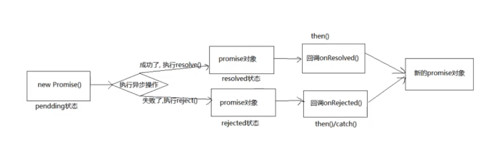

# 异步编程

- fs 文件操作
- 数据库操作
- Ajax 请求
- 定时器
- ...

# Promise

Promise 是JS中进行异步编程的一种解决方案

**优点**：

指定回调函数方法灵活

支持链式调用，解决回调地狱的问题

## Promise状态

promise实例对象的内置属性 ` [[PromiseState]]`。

pending => resolved / fulfilled

pending => rejected

状态只能从pending改变为成功或失败，且不可在改变。

Promise 实例对象还有另外一个内置属性 `[[PromiseResult]]`，该属性保存着成功或失败的结果

## Promise 工作流程



## Promise constructor

new Promise(executor): **执行器函数 executor 在promise内部是同步调用的**，异步操作在执行器函数中执行

## Promise.prototype.then(onResolved, onRejected)

onResolved: 成功回调 (value) => {}

onRejected：失败回调 (reason) => {}

指定用于得到成功的回调和用于得到失败的回调，返回一个新的 promise 对象

## Promise.prototype.catch(onRejected)

then 方法的语法糖，相当于调用 then(null, onRejected)

## Promise.resolve()

返回成功或失败的promise对象

Promise.resolve()的值为穿给它的第一个参数，且忽略多余参数，默认为undefined

如果参数为一个promise对象，则参数的结果即为Promise.resolve()的结果

## Promise.reject()

返回失败的的promise对象

Promise.reject() 实例化一个失败的promise并抛出一个异步错误，该异步错误不能使用try/catch捕获。它的值为传给他的第一个参数。

## Promise.all()

参数： 多个promise组成的数组

返回一个新的promise，只有所有promise都成功才成功，返回值为所有解决值的数组，如果有一个失败，则返回失败的结果值

## Promise.race()

参数：多个promise组成的数组

返回一个新的promise，以第一个完成的promise的返回值为返回结果

## 中断promise链式调用的方法

返回一个pending状态的promise即可中断then方法的链式调用

return new Promise(() => {})

---

# 异步函数

异步函数，即 `async/await`，ES8新增，以同步方式编写的代码能够异步执行。

async 关键字声明异步函数，可以用在函数声明，函数表达式，箭头函数和对象中的方法上，让函数具有异步特征，在参数和闭包方面异步函数任然具有普通函数的行为。

```js
async function foo() {}
let bar = async function() {}
let baz = async () => {}
class Qux {
    async qux() {}
}

async function foo() {
    console.log(1);
}
foo();
console.log(2)
// 1
// 2
```

默认返回undefined。

使用return 关键字返回的值会被Promise.resolve()包装成一个promise对象。

异步函数始终返回Promise对象。**失败的promise不会被异步函数捕获，需要使用try/catch来处理**。

await 关键字可以暂停异步函数代码的执行，等待promise解决。

await 关键字可以单独使用，也可以在表达式中使用。

await 必须在异步函数中使用。

异步函数如果不包含await关键字，其执行基本和普通函数没区别。

及时await后跟着一个立即可用的值，函数的额其余部分也会被异步执行。

