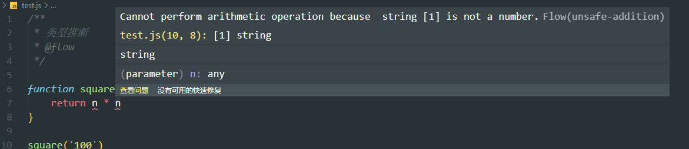
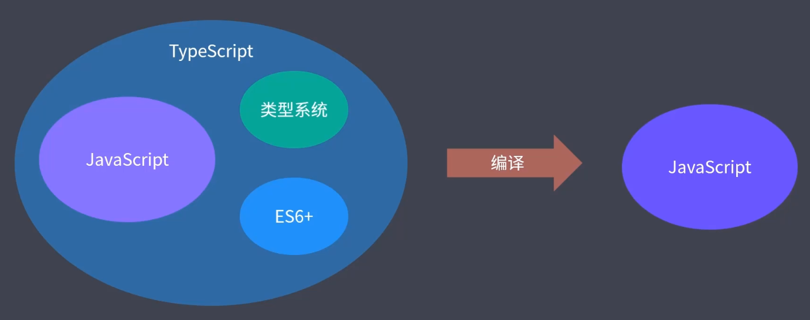

# TypeScript

## 强弱类型

从安全角度语言可以分为强类型语言和弱类型语言

强类型有更强的类型约束，强类型语言中不允许数据的隐式类型转换。弱类型语言反之。

变量类型允许随时改变不是强弱类型的差异。

**静态类型与动态类型**

静态类型语言中，变量声明时类型就是明确的且声明后不可修改。

动态类型语言中，运行阶段才能明确变量类型，也可以说变量是没有类型的，变量值是有类型的

早期JavaScript应用简单，是一门脚本语言，不需要编译直接运行，没有编译环节。

综上来看，JavaScript是一门弱类型的动态类型语言。


而随着应用越来越复杂，作为一门弱类型的动态类型语言，JavaScript就显得比较吃力。

弱类型语言的问题：

- 类型不确定，造成函数功能发生改变
- 存在隐式转换，造成对象索引器错误的用法
- 类型异常要等到运行时才能发现

强类型语言的优点：

1. 错误更早暴露
2. 代码更加只能，编码更准确
3. 重构更加牢靠
4. 减少不必要的类型判断

---

## Flow

由Facebook发布的一款JavaScript类型检查器，一个小工具。

在开发阶段在代码中添加类型注解的方式标记变量或参数的类型，flow根据类型注解检查代码中是否存在类型异常，从而实现开发过程中的类型检查，避免在运行阶段再进行类型检查。使用时在代码之前加上 `// @flow`这样一个注释标记。

flow工具安装：`yarn add flow-bin --dev`

初始化：`yarn flow init`

运行flow进行类型检查：`yarn flow`

```js
// @flow
function sum (a: number, b: number) {
    return a + b;
}
```

额外的类型注解可以在运行之前通过 Babel或者Flow 提供的模块自动取出，所以在生产环境没有影响。

**移除类型注解**：

1. Flow官方提供的移除工具：`yarn add flow-remove-types --dev`， `yarn flow-remove-types . -d dist`

2. Babel: `yarn add @bable/core @babel/cli @babel/preset-flow --dev`，添加 .bablerc配置文件，配置 presets：

    ```json
    {
        "presets": ["@babel/preset-flow"]
    }
    ```

    `yarn babel src -d dist`

**Flow开发工具插件**

vscode 安装 Flow Language support 插件，其他编辑器查看flow官网获取

flow具有类型推断功能。根据代码推断变量或参数的类型。

```js
/**
 * 类型推断
 * @flow
 */

function square(n) {
    return n * n
}

square('100')
```



```js
/**
 * 类型注解
 *
 * @flow
 */

function square (n: number) {
  return n * n
}

let num: number = 100

// num = 'string' // error

function foo (): number {
  return 100 // ok
  // return 'string' // error
}

function bar (): void {
  // return undefined
}
```

```js
/**
 * 原始类型
 *
 * @flow
 */

const a: string = 'foobar'

const b: number = Infinity // NaN // 100

const c: boolean = false // true

const d: null = null

const e: void = undefined

const f: symbol = Symbol()
```

```js
/**
 * 数组类型
 *
 * @flow
 */

const arr1: Array<number> = [1, 2, 3]

const arr2: number[] = [1, 2, 3]

// 元组 固定长度的数组
const foo: [string, number] = ['foo', 100]
```

```js
/**
 * 对象类型
 *
 * @flow
 */

const obj1: { foo: string, bar: number } = { foo: 'string', bar: 100 }

const obj2: { foo?: string, bar: number } = { bar: 100 } // foo?: foo 属性可有可无

const obj3: { [string]: string } = {}

obj3.key1 = 'value1'
obj3.key2 = 'value2'
```

```js
/**
 * 函数类型
 *
 * @flow
 */
// 限制回调函数的参数类型和返回值类型
function foo (callback: (string, number) => void) {
  callback('string', 100)
}

foo(function (str, n) {
  // str => string
  // n => number
})
```

```js
/**
 * 特殊类型
 *
 * @flow
 */

// 字面量类型 

const a: 'foo' = 'foo'

const type: 'success' | 'warning' | 'danger' = 'success'

// ------------------------

// 声明类型

type StringOrNumber = string | number

const b: StringOrNumber = 'string' // 100

// ------------------------

// Maybe 类型

const gender: ?number = undefined
// 相当于
// const gender: number | null | void = undefined
```

```js
/**
 * Mixed Any
 *
 * @flow
 */

// string | number | boolean | ....
// mixed 是类型安全的
function passMixed (value: mixed) {
  if (typeof value === 'string') {
    value.substr(1)
  }

  if (typeof value === 'number') {
    value * value
  }
}

passMixed('string')

passMixed(100)

// ---------------------------------
// 不推荐使用any类型
function passAny (value: any) {
  value.substr(1)

  value * value
}

passAny('string')

passAny(100)
```

FLow运行环境API，官网查看

---

## TypeScript

typescript是JavaScript类型的超集，可以编译为纯JavaScript。

 

TypeScript功能更强大，生态更健全完善。

Angular、vue3.0都使用typescript开发。前端领域的第二语言。

```js
// 可以完全按照JS语法编写
const hello = (name: String) => {
    console.log(`hello, ${name}`);
}

hello('Tom');
// hello(100)
```

**ts配置文件**：

运行 `yarn tsc --init`命令生成tsconfig.json配置文件

修改配置文件属性值。

直接运行tsc命令编译整个文件： `yarn tsc`

```js
// 原始数据类型

const a: string = 'foobar'

const b: number = 100 // NaN Infinity

const c: boolean = true // false

// 在非严格模式（strictNullChecks）下，
// string, number, boolean 都可以为空
// const d: string = null
// const d: number = null
// const d: boolean = null

const e: void = undefined

const f: null = null

const g: undefined = undefined

// Symbol 是 ES2015 标准中定义的成员，
// 使用它的前提是必须确保有对应的 ES2015 标准库引用
// 也就是 tsconfig.json 中的 lib 选项必须包含 ES2015，但是会覆盖掉默认标准库，此时需要添加回来 DOM
const h: symbol = Symbol()

// Promise

// const error: string = 100
```

标准库就是内置对象所对应的声明

**typescript 作用域**

默认文件中的成员会作为全局成员

多个文件中有相同成员就会出现冲突；

解决办法1: IIFE 提供独立作用域

解决办法2: 在当前文件使用 *export*，也就是把当前文件变成一个模块，模块有单独的作用域

```js
// Object 类型

export {} // 确保跟其它示例没有成员冲突

// object 类型是指除了原始类型以外的其它类型
const foo: object = function () {} // [] // {}

// 如果需要明确限制对象类型，则应该使用这种类型对象字面量的语法，或者是「接口」
const obj: { foo: number, bar: string } = { foo: 123, bar: 'string' }

// 对象类型限制更专业的方式是使用接口，接口的概念后续介绍
```

```js
// 数组类型的两种表示方式

const arr1: Array<number> = [1, 2, 3]

const arr2: number[] = [1, 2, 3]

// 案例 -----------------------

// 如果是 JS，需要判断是不是每个成员都是数字
// 使用 TS，类型有保障，不用添加类型判断
function sum (...args: number[]) {
  return args.reduce((prev, current) => prev + current, 0)
}

sum(1, 2, 3) // => 6
```

```js
// 元组（Tuple）

export {} // 确保跟其它示例没有成员冲突

const tuple: [number, string] = [18, 'zce']

// const age = tuple[0]
// const name = tuple[1]
// 解构方式：
const [age, name] = tuple

// ---------------------

const entries: [string, number][] = Object.entries({
  foo: 123,
  bar: 456
})

const [key, value] = entries[0]
// key => foo, value => 123
```

```js
// 枚举（Enum）

export {} // 确保跟其它示例没有成员冲突

// 用对象模拟枚举
// const PostStatus = {
//   Draft: 0,
//   Unpublished: 1,
//   Published: 2
// }

// 标准的数字枚举
// enum PostStatus {
//   Draft = 0,
//   Unpublished = 1,
//   Published = 2
// }

// 数字枚举，枚举值自动基于前一个值自增
// enum PostStatus {
//   Draft = 6,
//   Unpublished, // => 7
//   Published // => 8
// }

// 字符串枚举
// enum PostStatus {
//   Draft = 'aaa',
//   Unpublished = 'bbb',
//   Published = 'ccc'
// }

// 常量枚举，不会侵入编译结果
const enum PostStatus {
  Draft,
  Unpublished,
  Published
}

const post = {
  title: 'Hello TypeScript',
  content: 'TypeScript is a typed superset of JavaScript.',
  status: PostStatus.Draft // 3 // 1 // 0
}

// PostStatus[0] // => Draft	
```

```js
// 函数类型

export {} // 确保跟其它示例没有成员冲突
// 函数声明
function func1 (a: number, b: number = 10, ...rest: number[]): string {
  return 'func1'
}

func1(100, 200)

func1(100)

func1(100, 200, 300)

// -----------------------------------------
// 函数表达式
const func2: (a: number, b: number) => string = function (a: number, b: number): string {
  return 'func2'
}
```

```js
// 任意类型（弱类型）

export {} // 确保跟其它示例没有成员冲突

function stringify (value: any) {
  return JSON.stringify(value)
}

stringify('string')

stringify(100)

stringify(true)

let foo: any = 'string'

foo = 100

foo.bar()

// any 类型是不安全的
```

```js
// 隐式类型推断

export {} // 确保跟其它示例没有成员冲突

let age = 18 // number
age = 'string' // 报错

let foo // any 类型

foo = 100

foo = 'string'

// 建议为每个变量添加明确的类型标注
```

```js
// 类型断言：和类型转换是有本质差异的，类型断言编译过程中的概念，编译过后就不存在了，类型转换是运行时的概念。

export {} // 确保跟其它示例没有成员冲突

// 假定这个 nums 来自一个明确的接口
const nums = [110, 120, 119, 112]

const res = nums.find(i => i > 0)

// const square = res * res

// 设置断言的两种方法
const num1 = res as number
const num2 = <number>res // JSX 下不能使用，推荐使用第一种 as 的方式
```

```js
// 接口：约束对象的结构。

export {} // 确保跟其它示例没有成员冲突

interface Post {
  title: string
  content: string
}

function printPost (post: Post) {
  console.log(post.title)
  console.log(post.content)
}

printPost({
  title: 'Hello TypeScript',
  content: 'A javascript superset'
})
```

```js
// 可选成员、只读成员、动态成员

export {} // 确保跟其它示例没有成员冲突

// -------------------------------------------

interface Post {
  title: string
  content: string
  subtitle?: string // 可选成员，后面加 ?
  readonly summary: string // 只读成员，前面加 readonly 关键字
}

const hello: Post = {
  title: 'Hello TypeScript',
  content: 'A javascript superset',
  summary: 'A javascript'
}

// hello.summary = 'other'

// ----------------------------------

interface Cache {
  [prop: string]: string // 动态成员 
}

const cache: Cache = {}

cache.foo = 'value1'
cache.bar = 'value2'
```

```js
// 类（Class）

export { }; // 确保跟其它示例没有成员冲突

class Person {
    // ts 中需要明确声明构造函数需要的属性
    name: string; // = 'init name'
    age: number;

    constructor(name: string, age: number) {
        this.name = name;
        this.age = age;
    }
    
    sayHi(msg: string): void {
        console.log(`I am ${this.name}, ${msg}`);
    }
}
```

```js
// 类的访问修饰符

export {} // 确保跟其它示例没有成员冲突

class Person {
  public name: string // = 'init name'
  private age: number // 只能在Person类中访问
  protected gender: boolean // 只能在类Person及其子类中访问
  
  constructor (name: string, age: number) {
    this.name = name
    this.age = age
    this.gender = true
  }

  sayHi (msg: string): void {
    console.log(`I am ${this.name}, ${msg}`)
    console.log(this.age)
  }
}

class Student extends Person {
  private constructor (name: string, age: number) {
    super(name, age)
    console.log(this.gender)
  }

  static create (name: string, age: number) {
    return new Student(name, age)
  }
}

const tom = new Person('tom', 18)
console.log(tom.name)
// console.log(tom.age)
// console.log(tom.gender)

const jack = Student.create('jack', 18)
```

```js
// 类的只读属性

export { } // 确保跟其它示例没有成员冲突

class Person {
    public name: string // = 'init name'
    private age: number
    // 只读成员
    protected readonly gender: boolean

    constructor(name: string, age: number) {
        this.name = name
        this.age = age
        this.gender = true
    }

    sayHi(msg: string): void {
        console.log(`I am ${this.name}, ${msg}`)
        console.log(this.age)
    }
}

const tom = new Person('tom', 18)
console.log(tom.name)
// tom.gender = false
```

```js
// 类与接口

export { } // 确保跟其它示例没有成员冲突

interface Eat {
    eat(food: string): void
}

interface Run {
    run(distance: number): void
}

class Person implements Eat, Run {
    eat(food: string): void {
        console.log(`优雅的进餐: ${food}`)
    }

    run(distance: number) {
        console.log(`直立行走: ${distance}`)
    }
}

class Animal implements Eat, Run {
    eat(food: string): void {
        console.log(`呼噜呼噜的吃: ${food}`)
    }

    run(distance: number) {
        console.log(`爬行: ${distance}`)
    }
}
```

```js
// 抽象类

export { } // 确保跟其它示例没有成员冲突

abstract class Animal {
    eat(food: string): void {
        console.log(`呼噜呼噜的吃: ${food}`)
    }

    abstract run(distance: number): void
}

class Dog extends Animal {
    run(distance: number): void {
        console.log('四脚爬行', distance)
    }

}

const d = new Dog()
d.eat('嗯西马')
d.run(100)
```

```js
// 泛型

export {} // 确保跟其它示例没有成员冲突

function createNumberArray (length: number, value: number): number[] {
  const arr = Array<number>(length).fill(value)
  return arr
}

function createStringArray (length: number, value: string): string[] {
  const arr = Array<string>(length).fill(value)
  return arr
}
// 泛型
function createArray<T> (length: number, value: T): T[] {
  const arr = Array<T>(length).fill(value)
  return arr
}

// const res = createNumberArray(3, 100)
// res => [100, 100, 100]

const res = createArray<string>(3, 'foo')
```

```js
// 类型声明

import { camelCase } from 'lodash'
import qs from 'query-string'

qs.parse('?key=value&key2=value2')

// declare function camelCase (input: string): string

const res = camelCase('hello typed')
```

